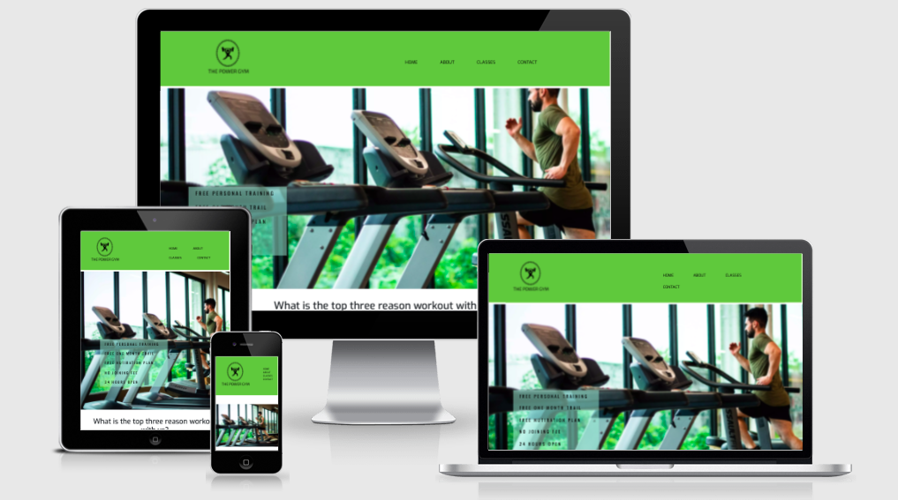

# The Power Gym website

## User-Centric Frontend Development Milestone Project.

Website presents The Power Gym as a fitness club, personal training, classes and nutritions. Users will be able to find interesting content in easy and simple way.

This project is for educational purposes and can not be used as a template for a business use. Main aim is to build responsive website with HTML and CSS only. I will use Bootstrap framework to keep website consent and clear.

## [View life website in github pages]( https://kaanalptkn.github.io/milestone-project-kaan/)

# Table of Contents

[UX](#ux)
"COME BACK FOR CONTENTS"

# UX 

## Website owner business goals

The main idea for creating this website is to help provide a fitness club to users. Page owner can present their gym club, professional development path, achievements, and best skills as a team. Also, this website is the perfect platform for anyone looking for fitness classes, personal training, and healthy nutrition. Finally, the owner will be able to submit an offer with available packages and prices, classes.

## User goals

### New user goals

* User able to find information about gym facilities.
* User can locate class sessions, personal training sessions, individual gym programs.
* Easily find location and contact informations.

### Returning user goals

* The user is able to learn about facilities.
* The user could find the classes timetable.
* Users can send a message to the instructor using a contact form or just to call us.

## User stories

### As a business owner

* I would like to present services and my offer on the website clearly to potential customers.

* Classes, services of the instructors are on each page in the navigation section. 

* I need to make sure that my current and new customers will find professional help with their diets, personal or group training.

* Customers could get information this by contacting through the contact form or we have a classes timetable in the classes section.

* I want my customers to be able to learn how to use my website regularly and easily.

* I would like to build a relationship with potential and current customers.

* Customers are able to find links to social channels at the bottom of each page. Alternatively, they can contact by email or contact form. Also every three months we apply new challenges to our classes and try to bring the new types of equipment. 

### As a new user

* I need to join classes
There is all information about classes on the classes section on the webpage.

* I need to learn how to use equipment and a new program.
Every new member will get 45 min free session with PT, they will prepare an individual program for each customer and will teach you how to use equipments.

* I need to have a diet with my gym workout.
Our professional nutritionist, whoever helping our customers with their diet plan.

* I need individual session.
We have a great PT team, he/she will be more than happy to help our new members help with. 

### As a returning customer

* I need to join again.
The returning member could join anytime and they can continue where did they stop. 

* I need a new diet plan.
Users can call us, send an email, alternatively they can contact us over social media. 

* I have to start with classes.
Members could get information about classes through the website on the Classes section. 

