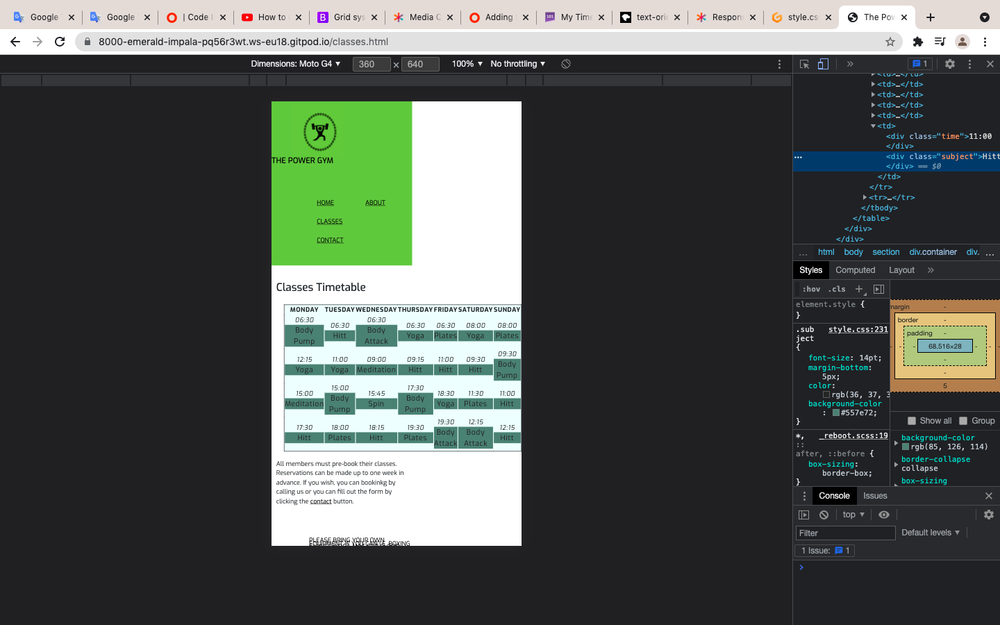

# The Power Gym website

## User-Centric Frontend Development Milestone Project.

Website presents The Power Gym as a fitness club, personal training, classes and nutritions. Users will be able to find interesting content in easy and simple way.

This project is for educational purposes and can not be used as a template for a business use. Main aim is to build responsive website with HTML and CSS only. I will use Bootstrap framework to keep website consent and clear.

## [View life website in github pages](https://kaanalptkn.github.io/ka-p1/)

# Table of Contents

- [UX](#ux)
   - [Website owner business goals](#Website-owner-business-goals)
   - [User goals](#User-goals)
      - [New user goals](New-user-goals)
      - [Returning user goals](Returning-user-goals)
      - [Website owner business goals](#Website-owner-business-goals)
   - [User stories](#User-stories)
      - [As a business owner](#As-a-business-owner)
      - [As a new user](As-a-new-user)
      - [As a returning customer](#As-a-returning-customer)
   - [Structure of the website](#Structure-of-the-website)
   - [Wireframes](#Wireframes)
   - [Surface](#Surface)
      - [Colors](#Colors)
      - [Fonts](#Fonts)
      - [Images](#Images)
-  [Fetures](#Fetures)
-  [Technologies](#Technologies)
-  [Testing](#Testing)
   - [Functionality testing](#functionality-testing)
   - [Compatibility testing](#compatibility-testing)
   - [Code Validation](#code-validation)
   - [User stories testing](#user-stories-testing)
   - [Issues found during site development](#issues-found-during-site-development)
   - [Performance testing](#performance-testing)
-  [Deployment](#deployment)
- [Credits](#Credits)
- [Screenshots](#screenshots)

# UX 

## Website owner business goals

The main idea for creating this website is to help provide a fitness club to users. Page owner can present their gym club, professional development path, achievements, and best skills as a team. Also, this website is the perfect platform for anyone looking for fitness classes, personal training, and healthy nutrition. Finally, the owner will be able to submit an offer with available packages and prices, classes.

## User goals

### New user goals

* User able to find information about gym facilities.
* User can locate class sessions, personal training sessions, individual gym programs.
* Easily find location and contact informations.

### Returning user goals

* The user is able to learn about facilities.
* The user could find the classes timetable.
* Users can send a message to the instructor using a contact form or just to call us.

## User stories

### As a business owner

* I would like to present services and my offer on the website clearly to potential customers.

* Classes, services of the instructors are on each page in the navigation section. 

* I need to make sure that my current and new customers will find professional help with their diets, personal or group training.

* Customers could get information this by contacting through the contact form or we have a classes timetable in the classes section.

* I want my customers to be able to learn how to use my website regularly and easily.

* I would like to build a relationship with potential and current customers.

* Customers are able to find links to social channels at the bottom of each page. Alternatively, they can contact by email or contact form. Also every three months we apply new challenges to our classes and try to bring the new types of equipment. 

### As a new user

* I need to join classes 
* I would like to learn how to use equipment and a new program for myself.
* I want to have a diet with my gym workout.
* I wish to have an individual session for my workout plan.

### As a returning customer

* I need to join again for improve my body and to get fit . 
* I wish to have a new diet plan with my workout. 
* I would like to start with group session, it is encouraged me.

## Structure of the website

The website is designed to be simple and user-friendly on all types of devices. On desktop, tablet, or mobile device there should be no difference for a user to have a great experience. All parts are designed to concentrate maximum user satisfaction. Users will get some interaction from the interface as links and buttons will have a hover effect.

## Wireframes

I used this website Balsamiq to create  wireframes.

## Surface

### Colors

Main colours used in a project:
* background color: #7cbf40
* font color: rgba(0, 0, 0, 0.945)
* link color: #0d6efd
* hoover color: #ff9000

### Fonts
* As a main font I used Exo and Oswald, and as a backup font sans-serif

### Images
* I used images from [Pixel.com](https://www.pexels.com/), [Unsplash.com](https://unsplash.com/) and there are credited in [credits](#credits) section.

[Back to Table of contents](#table-of-contents)

___

# Fetures

The website consists of 4 pages. Four are accessible from a navigation menu.

The website has below features:

## Navigation bar

* #### Navigation bar is visible on the top of each website. It is responsive and will adapt to mobile devices by a change into a burger menu.

* Navigation scheme:

 * On left side there is a logo. It can be used as navigation link to the main page.
 * On right side there are four links or nav menu. It contains:
   * Home
   * About
   * Classes
   * Contact

## Timetable 

* Customers can find classes times here. Also information abut lessons. 

## Footer

* Footer is consistent on all pages. It has contact details on left side, copyright in the middle  and social links on right side. Each link will open in a separate tab in a browser.

## Home

* ### Hero Image

   * The man is running on the treadmill. The photographer is moving, I use hover effect here. It encourages people to join gym.

* ### Cover text
  
  * Headlines about promotions draw attention here.

* ### Paragraph section

  * In this part has three columns, first one short paragraph, basically explaning how we work and what benefit will get user, middle column is motivation slogans and right side is a man picture and seems happy man to be in gym. 

## About

* About us gives information about The Power Gym Clubs  background. Also the on bottom there’s a different pictures from different classes, personal training and gym equipments. 

## Classes

* This section provide classes time-tables with lessons, time and there is an explanation what exactly about the classes. Also what you need to bring with.

## Contact

* Contact form is a main part on this site. User can contact by filling a form with interesting topic. Also our full address with contact number apperaed.  Below a form there is a map with location of a fitness studio.

## Future implementations

* Create gym package  offer.
* Add new site with class descriptions.
* Fitness advises. Ideas and nutrition.
* 24 hours gym online lessons

[Back to Table of contents](#table-of-contents)

___

# Technologies used

### HTML

* As a structure language.

### CSS

* As a style language.

### Bootstrap

* Bootstrap@5.1.3 as a CSS framework to keep responsive, media queries, tables an form.

### Font Awesome

* As an icon library for main page slogans and a social links.

### Google fonts

* As a font generator

### GitHub

* It is a software hosting platform and  for keep the project remote location.

### Git

* As a ibformation tracker on version control system.

### Gitpod

* As a development hosting platform.

### Balsamiq

* As a wireframe tool.

### Freelogo Design

* As a design logo

[Back to Table of contents](#table-of-contents)

___

# Testing 

## Functional testing

For testing and solving problems with responsiveness and style issues I used Google Chrome developer tools and Mozilla web developer tools.

[Unicorn Revealer](https://chrome.google.com/webstore/detail/unicorn-revealer/lmlkphhdlngaicolpmaakfmhplagoaln?hl=en-GB) was very handy and it helped me a lot when I built my website. 

## Compatibility testing

My website been tested with multiple mobile devices and browsers. I've tested all extention  devices in both Mozilla web developer tolls and Chrome developer tools. 
 
Also I tested on hardware devices such as: Iphone 6, Iphone 7, Iphone 11, Iphone 12 and Samsung Galaxy S10, S20, Galaxy S21. 

## User stories testing

###  As a business owner:

- I desire to represent the offers and benefits of my company on the website clearly to potential customers.
    > Services such as gym, personal training, nutrition, classes with details are on each page.
- I need to make sure that my current and new customers will find professional help with their diets, personal or group training.
    > Customers could get through this with a fulfilling contact form on the contact section or they can just call us. They can choose the topic and describe their needs in a comment box.

- I want my customers to be able to learn how to use my website intensively and easily.
    > Each page on the header has a navigation menu and is accessible at all times. All customers can use it trouble-free anytime. 

- I would like to connect with a relationship with potential and current customers.
    > All social media links are on the bottom of each page. Alternatively, they can just call us, fill the form or send an email. 

### As a new cutsomer

- I need to join classes 
  > There is all information about classes on the classes section on the webpage.

- I need to learn how to use equipment and a new program for myself.
  > Every new member will get 45 min free session with PT, they will prepare an individual program for each customer and will teach you how to use equipments.

- I need to have a diet with my gym workout.
  > Our professional nutritionist, whoever helping our customers with their diet plan.

- I need individual session for my workout plan.
  > We have a great PT team, he/she will be more than happy to help our new members help with. 

### As a returning customer:

- I need to join again and improve my body.
 > The returning member could join anytime and they can continue where did they stop. 

- I wish to have a new diet plan with my workout.
 > Users can call us, send an email, alternatively they can contact us over social media. 

- I would like to start with grpup session, it is encaurge me.
 > Members could get information about classes through the website on the Classes section. 
 ___

 ## Issues found during site development

 #### Table element on "About" section

 

 My table wasn't right on mobile view. Then I added  class="overflow-x: auto; to my "div" element on html,  I sorted, I made is scroll, which is looks fantastic on my mobile view.

#### Safari (IPhone) view was wrond.

My safari (IPhone view) was wrong. I checked on iPhone 6, iPhone 7, iPhone 11, iPhone 12 and all of them have had a same issue. My hero picture (run.jpg) was on the header. You couldn't see navigation on header. I. used [stackoverfelow.com](https://stackoverflow.com/questions/30102792/css-media-query-to-target-only-ios-devices) I added below elemnt on my css. 

![bug3.png]{testing/bug3.png}

## Performance testing

I used [Lighthouse](https://developers.google.com/web/tools/lighthouse/) for performace testing. I found it very handy and useful. I found a some issue and fixed. It was images size big I made resize, also I had a wrong value on my  html "meta" element, user-scalable=no I just removed.

### Final result:

## Code validation

* [W3C HTML validator](https://validator.w3.org/)
* [W3C CSS validator](https://jigsaw.w3.org/css-validator/)

[Back to Table of contents](#table-of-contents)

___

# Deployment

My project was deployed on GitHub Pages. I used Gitpod as a development occasion,  I commit all changes to git version control system. 
I used push command in Gitpod to save all my changes into GitHub.

To deploy a project I used the following instructions:

1. Log in to GitHub and open the repository to deploy ([KA-P1](https://kaanalptkn.github.io/ka-p1/))
2. Select `Settings`(on the right side, not top of the page) and then from right side of the menu find  "Pages" section at the very bottom of the page
3.  Select the `main` branch as the source.
4.  click `save` and page was deployed after auto-refresh.
>  Your site is published at https://kaanalptkn.github.io/ka-p1/

To run localy:
1. Log in to GitHub and click on repository to download ([KA-P1](https://kaanalptkn.github.io/ka-p1/))
2. Select `Code` and click Download the ZIP file.
3. When download you can extract the file and use it in your local environment 

Alternatively, you can [Clone](https://docs.github.com/en/free-pro-team@latest/github/creating-cloning-and-archiving-repositories/cloning-a-repository)
or [Fork](https://docs.github.com/en/free-pro-team@latest/github/getting-started-with-github/fork-a-repo)
this repository ([KA-P1](https://kaanalptkn.github.io/ka-p1/)) into your github account.

[Back to Table of contents](#table-of-contents)

___

# Credits

# Code

* Bootstrap [Grid](https://getbootstrap.com/docs/5.0/layout/grid/)
* Bootstrap [Column](https://getbootstrap.com/docs/5.0/layout/columns/)
* Bootstrap [Gutters](https://getbootstrap.com/docs/5.0/layout/gutters/)
* Bootstrap [Form](https://getbootstrap.com/docs/5.0/forms/form-control/)
* Bootstrap [Select](https://getbootstrap.com/docs/5.0/forms/select/)
* W3 Schools [Responsive table](https://www.w3schools.com/howto/howto_css_table_responsive.asp)
* 101 Computing [Table](https://www.101computing.net/my-timetable-in-html-css/)

### Content

* General content [Nuffield Health](https://www.nuffieldhealth.com/)

### Map

[Google maps](https://www.google.com/maps/embed?pb=!1m18!1m12!1m3!1d2467.415801467523!2d-0.07422538423630705!3d51.79856264719357!2m3!1f0!2f0!3f0!3m2!1i1024!2i768!4f13.1!3m3!1m2!1s0x48762692ba358909%3A0x5c2ac80d1693a156!2sHertford%20SG14%201QA!5e0!3m2!1sen!2suk!4v1636712652016!5m2!1sen!2suk)

### Media

#### Image

##### [Pixel.com](https://www.pexels.com/)

* [William Choquette-an-on-treadmill](https://www.pexels.com/photo/an-on-treadmill-1954524/)

* [Andrea Piacquadio-man-in-black-tank-top-holding-orange-towel](https://www.pexels.com/photo/man-in-black-tank-top-holding-orange-towel-3917685/)

##### [Unsplash.com](https://unsplash.com/)

* [Ryan Snaadt-battle-rope](https://unsplash.com/photos/3NKKbXhpcaY) 

* [Damir Spanic-man-with-towel](https://unsplash.com/photos/rHDK3UU7HUw)

* [Bruce Mars-set-up](https://unsplash.com/photos/HHXdPG_eTIQ)

* [Bruce Mars-gJtDg6WfMlQ](https://unsplash.com/photos/gJtDg6WfMlQ)

* [Nathan Dumlao-personal-trainer](https://unsplash.com/photos/NXMZxygMw8o)

* [Madison lavern-namaste](https://unsplash.com/photos/4gcqRf3-f2I)

* [Carl Barcelo-a-woman-doing-a-yoga-pose](https://unsplash.com/photos/nqUHQkuVj3c)

* [Anastase Maragos-bodybuilder-and-online-coach](https://unsplash.com/photos/fG0p4Qh_aWI)

* [Bruce Mars-dumbell](https://unsplash.com/photos/jY-GlbKeTDs)

##### Logo 

* I created my logo on [Free Logo Design](https://www.freelogodesign.org/share/62ff1ae5b742479e8f1c71644ba4c312)

[Back to Table of contents](#table-of-contents)

___

# Screenhots

## Project screenshots:

[Back to Table of contents](#table-of-contents)

___
